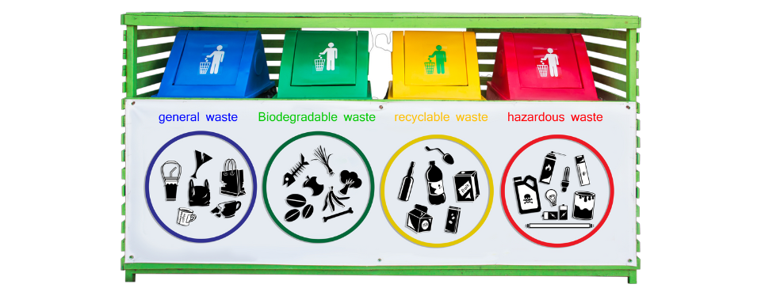

# Waste Classifier

#### The world generates approximately 6.1 million tons of waste per day and this number is increasing day by day. It's high time we take major steps towards waste management.
#### I have developed this machine learning (deep learning) model that can classify 9 categories of waste. When a random image of waste is fed into the model, it identifies the material in the image and classifies it as one of the 9 categories: Light Bulb, Paper, Plastic, Organic Waste, Glass, Batteries, Clothes, Metal and E-waste.

## Procedure Followed
- The first step was to collect data which I did from google images and dreamstime.com
- **8369 images** belonging **9 classes** were collected and preprocessed.
- The model was then trained using **VGG16** Transfer Learning technique of CNN for classification.
- The model was trained for **28 epochs** and which resulted in an accuracy of **69.77%**.

## Data Source
- Google Images
- dreamstime.com
- [Dataset Prepared](https://drive.google.com/drive/folders/1CTvT_gnTvwlcKwJ8yz4jUOs0JYTKrplA?usp=sharing)

## Demo

## Deployment
- Deployed using Azure Web App Service.
- [Live Link](http://wasterecycling-env.eba-xcpktyd2.us-east-2.elasticbeanstalk.com/)

## Technologies Used
<code></code>
<code></code>
<code></code>
<code></code>
<code></code>
<code></code>
<code></code>
<code></code>
<code></code>
<code></code>
<code></code>

## Motivation
[Watch Video](https://www.youtube.com/watch?v=NhF4pXBNfq8)
